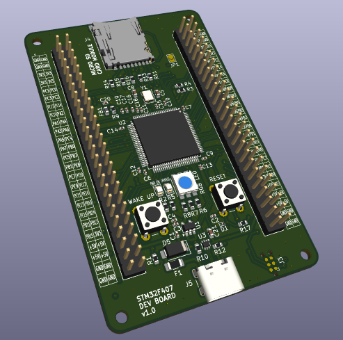
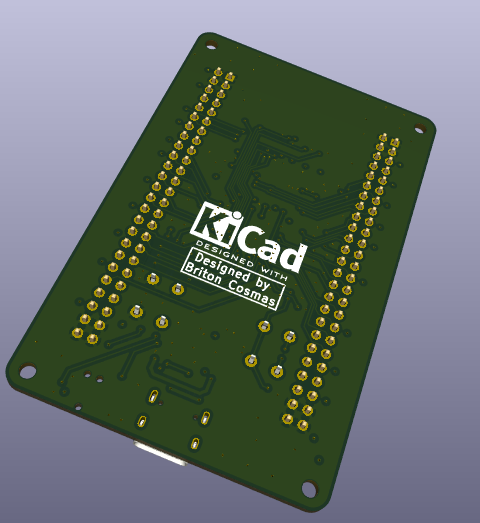
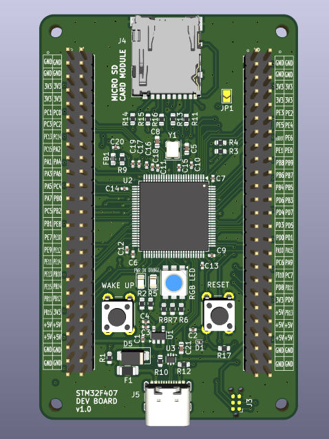
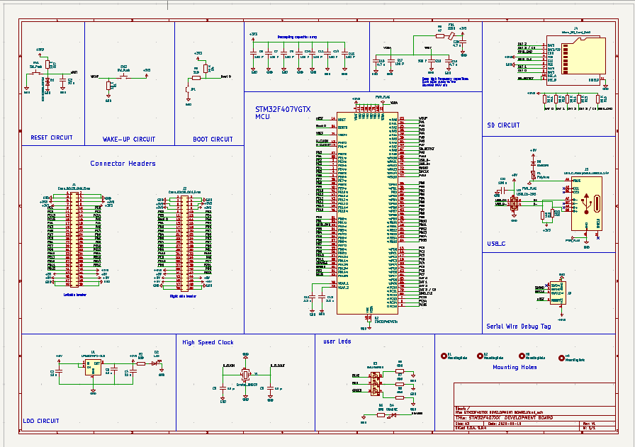

# Quick Preview

A custom STM32F407VGTx development board designed in KiCad 9.0, featuring the STM32F407 (LQFP100, Cortex-M4F @ 168 MHz) with an external crystal, USB Type-C power input, onboard microSD card slot, a user-programmable RGB LED, a "PWR ON" status LED, dedicated Wake-Up and Reset buttons, a BOOT0 force-boot jumper (JP1) for entering the system bootloader, an SWD/JTAG debug header for programming and debugging, and two 2×25 GPIO headers breaking out nearly the full MCU pinout along with 3V3/5V/GND rails for easy prototyping and shield/breadboard use.

AN STM32F407VGTX BASED DEVELOPMENT BOARD

  

Frontside_1 view of the development board 

Bottomside view of the development board

  

Frontside_2 view of the development board

  

Schematic view of the development board circuit

**The schematic has also been provided as a pdf in this repository for clear viewing

